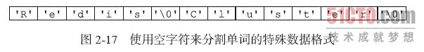
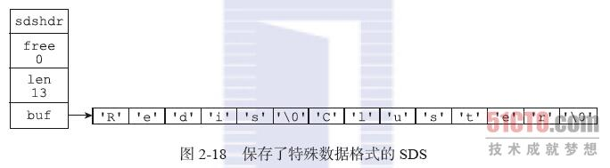

# 什么是二进制安全？
二进制安全是指，在传输数据时，保证二进制数据的信息安全，也就是不被篡改、破译等，如果被攻击，能够及时检测出来。
二进制安全包含了密码学的一些东西，比如加解密、签名等。

举个例子，你把数据11110000加密成10001000，然后传给我，就是一种二进制安全的做法。

redis中的二进制安全：
二进制安全

通俗地讲，C语言中用“\0”表示字符串的结束，如果字符串中本身就有“\0”字符，字符串就会被截断，即非二进制安全；若通过某种机制，保证读写字符串时不损害其内容，则是二进制安全。

字符串中的字符必须符合某种编码（比如ASCII），并且除了字符串的末尾之外，字符串里面不能包含空字符，否则最先被程序读入的空字符将被误认为是字符串结尾，这些限制使得字符串只能保存文本数据，而不能保存像图片、音频、视频、压缩文件这样的二进制数据。

举个例子，如果有一种使用空字符来分割多个单词的特殊数据格式，如下图所示，那么这种格式就不能使用C字符串来保存，因为C字符串所用的函数只会识别出其中的"Redis"，而忽略之后的"Cluster"。  

虽然数据库一般用于保存文本数据，但使用数据库来保存二进制数据的场景也不少见，因此，为了确保Redis可以适用于各种不同的使用场景，SDS的 API都是二进制安全的（binary-safe），所有SDS API都会以处理二进制的方式来处理SDS存放在buf数组里的数据，程序不会对其中的数据做任何限制、过滤、或者假设，数据在写入时是什么样的，它被读 取时就是什么样。

这也是我们将SDS的buf属性称为字节数组的原因——Redis不是用这个数组来保存字符，而是用它来保存一系列二进制数据。

例如，使用SDS来保存之前提到的特殊数据格式就没有任何问题，因为SDS使用len属性的值而不是空字符来判断字符串是否结束，如下图所示。  

通过使用二进制安全的SDS，而不是C字符串，使得Redis不仅可以保存文本数据，还可以保存任意格式的二进制数据。