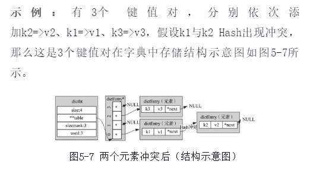

## Redis字典
又称为散列表(Hash Table)，Redis用来存储K-V型数据，整个数据库就是用字典来存储的。  
特征：  
1.可以存储海量数据， 
2.支持多种类型，且键唯一  
3.键值对中的类型可以为String/Hash/List/Set/SortedSet

### 取值
数组的下标取值，是通过头指针和偏移量offset来实现的.
当一个数组中数据非常海量时，通过头指针+偏移量的方式也能以O(1)的时间复杂度定位到数据所在的内存地址，然后进行对应的操作。
C数组的这个特性，显然是解决海量数据存储的关键。

用hash值与数组容量取余，会得到一个始终小于数组容量的值，此时的值当作数组下标来使用，也就是索引index
但是这个方法不是完美的，会出现一个问题：**Hash冲突**

### Hash冲突  
不同的键输入经过Hash计算之后具有强随机性，但也有小概率会重复，此时计算的索引值相同，也就是会关联到同一个数组下标，称之为键出现冲突。  


### Hash Table

```
typedef struct dictht {
    dictEntry **table;      //数组，存储键值对
    unsigned long size;     //数组容量
    unsigned long sizemask; //用来计算键的索引值，恒等于size-1
    unsigned long used;     //table中以存储的键值对个数
} dictht;
```

初始容量为4，随着键值对存储量增加，就需要扩容，对老的容量大小扩大一倍，4，8，16，32...
```C
#define DICT_HT_INITIAL_SIZE     4
```

索引值=Hash&掩码值  
idx = hash & d->ht[table].sizemask
其计算结果等同于Hash值与Hash表容量取余，而计算机的位运算比取余运算快很多。
```
h = dictHashKey(ht, he->key) & n.sizemask;
he->next = n.table[h];
n.table[h] = he;
ht->used--;
```

hashTable节点

```
typedef struct dictEntry {
    void *key;  //存储键
    union {
        void *val;      //db.dict中的val
        uint64_t u64;   
        int64_t s64;    //db.expires中存储国企时间
        double d;
    } v;                //值，联合体，存储的是键值对中的值，应对在不同场景
    struct dictEntry *next;//当hash冲突时，指向冲突的元素，形成单链表
} dictEntry;
```
当出现了Hash冲突时，next字段用来指向冲突的元素，通过头插法，形成单链表。



