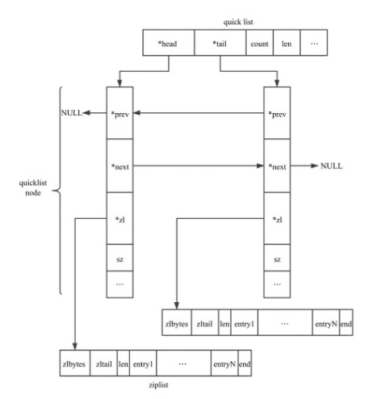
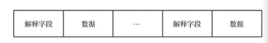

## quilklist介绍
quilkList由List和ziplist结合而成。  
能够再时间效率和空间效率实现好的折中   
quilkList是一个双向链表,链表中每个节点是一个ziplist结构。  
可以看成是用双向链表将若干小型的zipList连接到一起组陈给到一种数据结构。 
 当zipList节点个数过多，quilklist退化为双向链表，一个极端的情况就是当每个ziplist节点只包含一个entry，即只有一个元素。  
 当ziplist元素个数过少时，quillist可以退化为ziplist，一种极端的情况就是quilklist中只有一个ziplist节点.  

---

## quicklist结构图  
  
...
//TODO
   
---

## 数据压缩  
quicklist每个节点的实际数据存储结构为ziplist，这种结构的主要优势在于节省存储空间。  
为了进一步降低ziplist占用的空间，Redis允许对ziplist进一步压缩，  
Redis采用的压缩算法LZF，压缩过后的数据可以分成多个片段，每个片段有2部分：   
1.解释字段，描述数据格式  
2.数据字段  

数据格式分3种:  
1.字面型  解释字段占1字节，数据字段由后5位决定(000L LLLL)   
2.简短重复型  解释字段占2字节，没有数字字段，数据内容与前面数据内容重复，重复长度小于8(LLL0 000 0000 0000)  
3.批量重复型  解释字段占3字节，没有数据字段，数据内容与前面数据内容重复(11100000 LLLLLLLL 00000000)   

压缩的思想是：  
数据与前面重复的，记录重复位置和长度。否则记录原始数据内容。  

压缩算法的流程：  
1.遍历输入字符串\
2.对当前字符及后面2个字符进行hash运算\
3.如果在hash表中找到曾经出现的记录，则计算重复字节的长度和位置，反之直接输出数据.

   